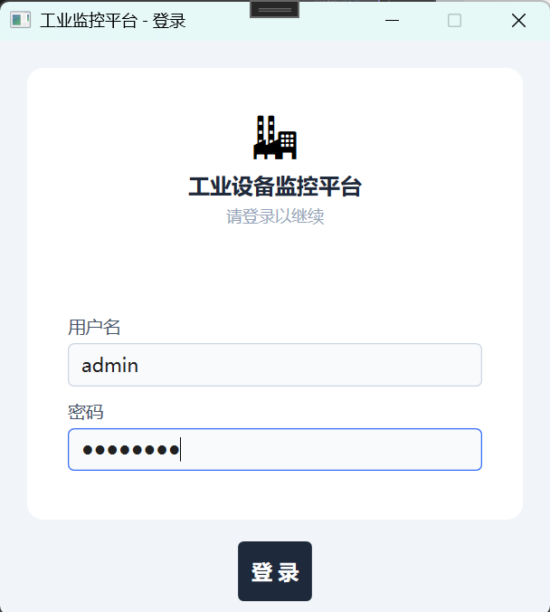
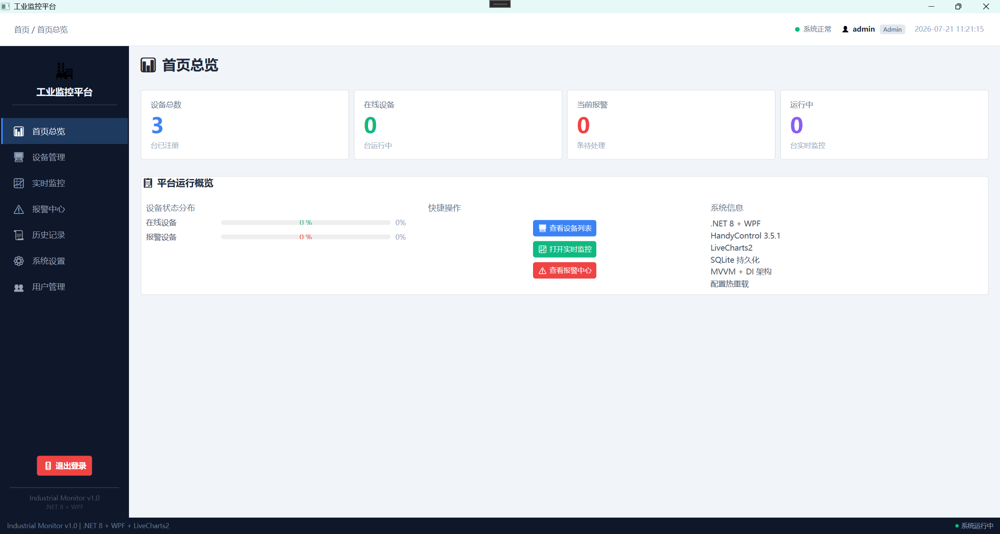
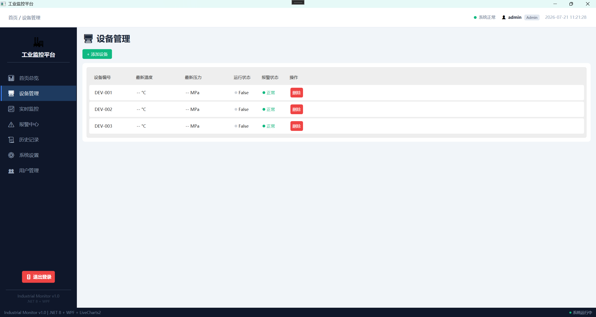
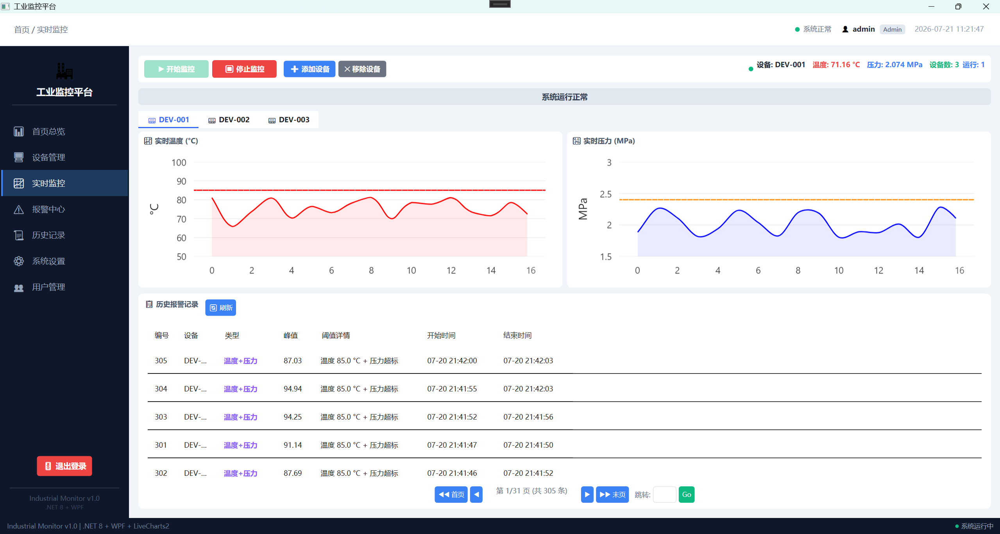
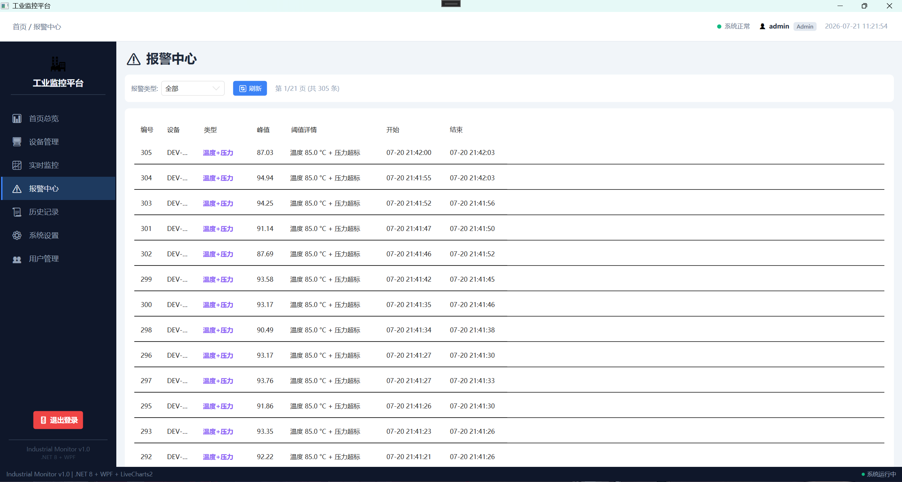
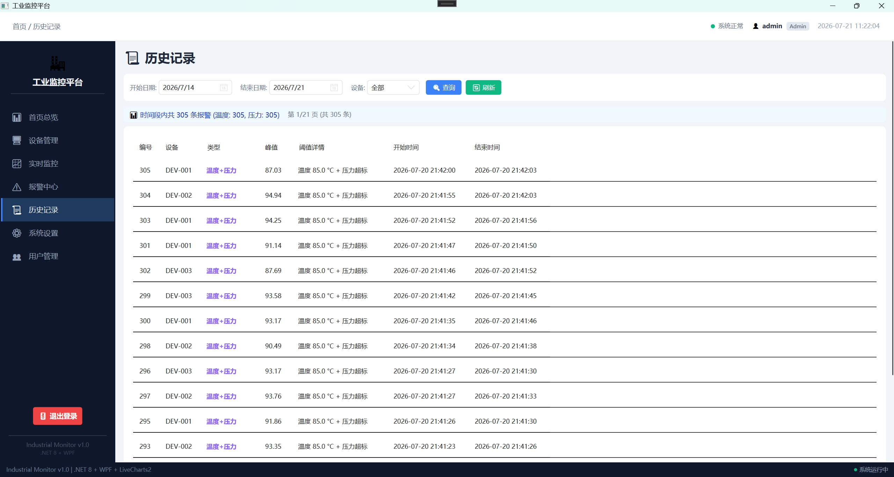
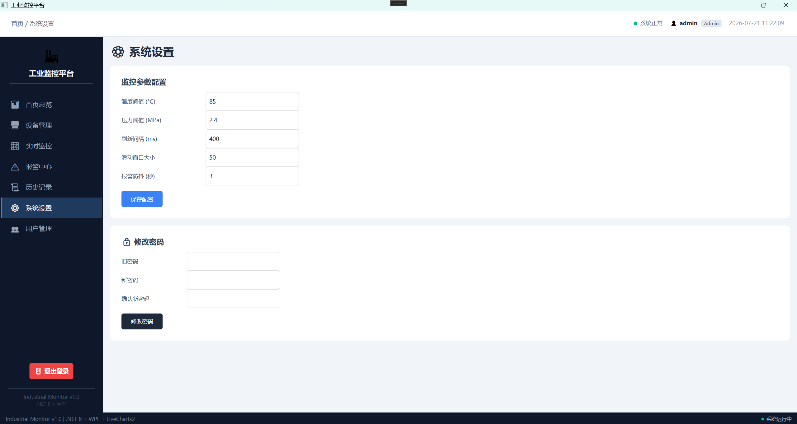
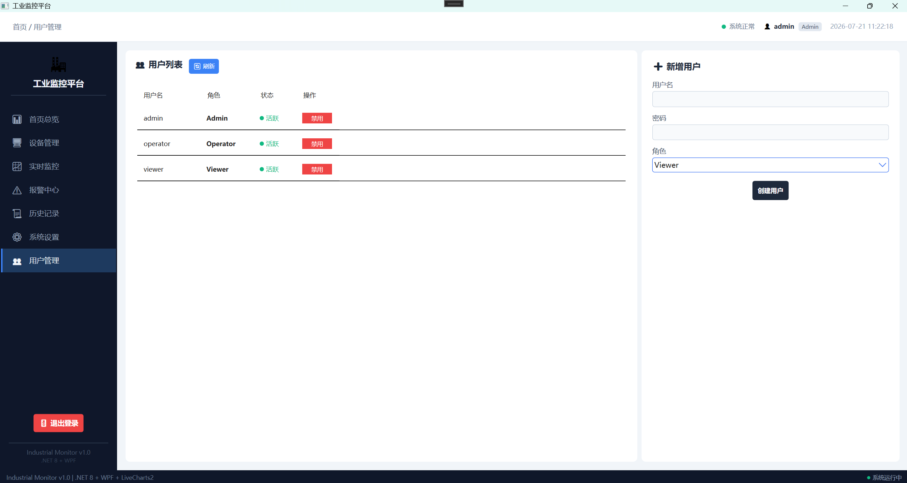

# IndustrialMonitor — 工业设备实时监控平台

基于 .NET 8 + WPF 的企业级工业设备监控控制台，采用 **MVVM + 依赖注入**架构，集成 LiveCharts2 实时图表、SQLite 数据持久化、基于角色的访问控制（RBAC）和配置热重载。

---

## 功能概览

### 系统截图

### 系统截图










### 核心功能

| 模块           | 功能                                                                                                                |
| -------------- | ------------------------------------------------------------------------------------------------------------------- |
| **登录系统**   | 用户名/密码验证，SHA256 密码哈希，角色分级（管理员 / 操作员 / 观察者）                                              |
| **首页仪表盘** | 设备统计卡片、在线率进度条、运行设备数、系统信息                                                                    |
| **设备管理**   | 设备列表 CRUD，运行状态与报警状态绿/红色标识                                                                        |
| **实时监控**   | 双通道 LiveCharts 折线图（温度 + 压力），阈值警戒虚线，3 秒防抖报警引擎，报警灯呼吸闪烁动画，多设备 TabControl 切换 |
| **报警中心**   | 按类型筛选，分页查询，颜色编码（温度红 / 压力蓝），阈值上下文显示                                                   |
| **历史记录**   | 日期范围筛选，设备过滤，分页查询，报警统计摘要                                                                      |
| **系统设置**   | 监控参数配置（阈值、刷新间隔、滑动窗口），配置热重载，修改密码                                                      |
| **用户管理**   | 管理员专属 — 查看用户列表，新增用户（Operator / Viewer），启用/禁用账户                                             |
| **权限控制**   | 管理员全功能，操作员无设备管理/设置/用户管理，观察者只读（操作按钮隐藏）                                            |
| **退出登录**   | 侧边栏底部退出按钮，返回登录界面                                                                                    |
| **设备持久化** | 设备列表 JSON 文件保存，重启/重登录不丢失                                                                           |

---

## 技术栈

| 技术                                         | 用途                                                    |
| -------------------------------------------- | ------------------------------------------------------- |
| **WPF (.NET 8)**                             | 桌面 UI 框架                                            |
| **CommunityToolkit.Mvvm** 8.4.2              | MVVM 源生成器：`[ObservableProperty]`、`[RelayCommand]` |
| **LiveCharts2** 2.0.5                        | 实时折线图渲染（SkiaSharp）                             |
| **HandyControl** 3.5.1                       | 企业级 UI 控件库（Card、全局样式）                      |
| **Microsoft.Data.Sqlite**                    | SQLite 数据库（报警记录 + 用户账户）                    |
| **Microsoft.Extensions.DependencyInjection** | DI 容器（Singleton / Transient 生命周期管理）           |
| **Microsoft.Extensions.Configuration**       | `appsettings.json` 配置系统 + 热重载                    |
| **System.Text.Json**                         | JSON 序列化（设备持久化 + 配置写入）                    |

---

## 项目架构

```
IndustrialMonitor/
├── Models/
│   ├── DeviceData.cs              # 设备数据点（POCO）
│   ├── AlarmRecord.cs             # 报警记录（SQLite 映射）
│   ├── MonitorConfig.cs           # 配置强类型模型
│   ├── NavMenuItem.cs             # 导航菜单项
│   └── User.cs                    # 用户模型
├── Services/
│   ├── IMockDataService.cs        # 数据模拟器接口
│   ├── IAlarmLogService.cs        # 报警日志接口
│   ├── MockDataService.cs         # 高频数据模拟（生产者-消费者）
│   ├── AlarmLogService.cs         # SQLite 报警存储
│   ├── DeviceManagerService.cs    # 设备生命周期管理（Singleton）
│   └── AuthService.cs             # 认证与权限服务（SHA256 + RBAC）
├── ViewModels/
│   ├── MainViewModel.cs           # Shell 外壳（导航 + 设备管理 + 退出）
│   ├── DeviceViewModel.cs         # 单设备监控（图表 + 报警引擎）
│   ├── NavigationViewModel.cs     # 侧边栏菜单 + 角色过滤
│   ├── LoginViewModel.cs          # 登录页逻辑
│   ├── DashboardViewModel.cs      # 首页统计卡片（2s 刷新）
│   ├── MonitoringViewModel.cs     # 实时监控页（分页 + 权限）
│   ├── AlarmCenterViewModel.cs    # 报警中心（筛选 + 分页）
│   ├── DeviceManagementViewModel.cs # 设备列表管理
│   ├── HistoryViewModel.cs        # 历史查询（日期筛选 + 分页）
│   ├── SettingsViewModel.cs       # 系统设置 + 修改密码
│   └── UserManagementViewModel.cs # 用户管理（管理员专用）
├── Views/
│   ├── LoginWindow.xaml            # 登录窗口
│   ├── SidebarView.xaml            # 深色侧边栏（220px）
│   ├── HeaderView.xaml             # 顶部状态栏（面包屑 + 用户 + 时钟）
│   ├── DashboardView.xaml          # 首页仪表盘（HandyControl Card）
│   ├── MonitoringView.xaml         # 实时监控（图表 + 分页报警列表）
│   ├── AlarmCenterView.xaml        # 报警中心（筛选 + 分页 DataGrid）
│   ├── DeviceManagementView.xaml   # 设备管理（ListView + 状态标识）
│   ├── HistoryView.xaml            # 历史记录（日期选择 + DataGrid）
│   ├── SettingsView.xaml           # 系统设置（参数表单 + 修改密码）
│   └── UserManagementView.xaml     # 用户管理（用户列表 + 新增表单）
├── Converters/
│   ├── AlarmTypeColorConverter.cs  # 报警类型 → 颜色
│   ├── AlarmThresholdConverter.cs  # 报警类型 + 阈值 → 上下文显示
│   └── ActiveButtonTextConverter.cs # IsActive → 按钮文字
├── App.xaml + App.xaml.cs          # DI 容器启动 + 登录流程
├── MainWindow.xaml                 # Shell 外壳布局
└── appsettings.json                # 可热重载配置
```

---

## 权限矩阵

| 角色         | 首页 | 监控 | 报警 | 历史 | 设备管理 | 设置 | 用户管理 | 操作设备 |
| ------------ | :--: | :--: | :--: | :--: | :------: | :--: | :------: | :------: |
| **Admin**    |  ✅  |  ✅  |  ✅  |  ✅  |    ✅    |  ✅  |    ✅    |    ✅    |
| **Operator** |  ✅  |  ✅  |  ✅  |  ✅  |    ❌    |  ❌  |    ❌    |    ✅    |
| **Viewer**   |  ✅  |  ✅  |  ❌  |  ❌  |    ❌    |  ❌  |    ❌    |    ❌    |

---

## 默认账户

| 用户名     | 密码          | 角色   |
| ---------- | ------------- | ------ |
| `admin`    | `admin123`    | 管理员 |
| `operator` | `operator123` | 操作员 |
| `viewer`   | `viewer123`   | 观察者 |

> 首次启动自动创建默认账户，密码 SHA256 哈希存储于 `users.db`。

---

## 配置

所有运行时可调参数集中在 `appsettings.json`，支持热重载：

```json
{
  "MonitorConfig": {
    "TemperatureThreshold": 85.0,
    "PressureThreshold": 2.4,
    "RefreshIntervalMs": 400,
    "SlidingWindowSize": 50,
    "AlarmDebounceSeconds": 3.0
  }
}
```

---

## 运行

```bash
dotnet run
```

或打开 `IndustrialMonitor.sln`，在 Visual Studio / Rider 中按 F5。

首次启动自动创建 `users.db`（三个默认账户）和 `devices.json`（设备列表持久化）。
